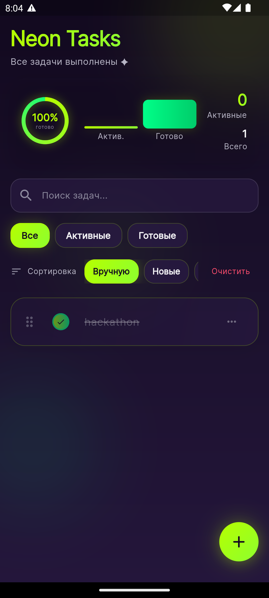
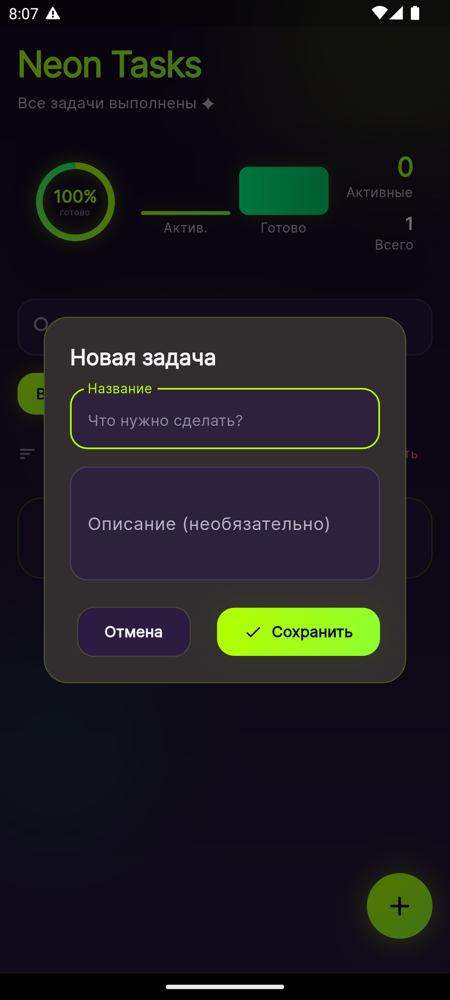

# Neon Tasks

Премиальное todo-приложение на Flutter в cyber-dark стиле: неоновые акценты, glassmorphism, анимации и локальное сохранение задач.

<p align="center">
  
  
  
  
</p>

---

## О проекте

**Neon Tasks** — менеджер задач с современным UI в духе cyberpunk / premium SaaS: тёмный фиолетовый фон, acid green акценты, плавные переходы и удобные жесты.

---

## Скриншоты

<p align="center">
  
  &nbsp;&nbsp;
  
</p>

|           Главный экран            |        Добавление задачи        |
| :--------------------------------: | :-----------------------------: |
| `docs/screenshots/home-mobile.png` | `docs/screenshots/add-task.png` |

---

## Возможности

- Создание, редактирование и удаление задач
- Отметка выполнения с анимацией
- Поиск, фильтры (все / активные / готовые) и сортировка
- Свайп вправо: «Готово» и «Удалить»
- Перетаскивание для изменения порядка (режим «Вручную»)
- Локальное хранение (`SharedPreferences`)
- Адаптивная вёрстка: mobile, tablet, desktop, web
- Cyber UI: градиенты, glassmorphism, neon glow

---

## Стек технологий

| Категория   | Технологии                                                                                                           |
| ----------- | -------------------------------------------------------------------------------------------------------------------- |
| Framework   | [Flutter](https://flutter.dev)                                                                                       |
| State       | [Provider](https://pub.dev/packages/provider)                                                                        |
| Storage     | [shared_preferences](https://pub.dev/packages/shared_preferences)                                                    |
| UI          | [google_fonts](https://pub.dev/packages/google_fonts), [flutter_slidable](https://pub.dev/packages/flutter_slidable) |
| Архитектура | Clean Architecture (domain / data / presentation)                                                                    |

---

## Быстрый старт

### Требования

- [Flutter SDK](https://docs.flutter.dev/get-started/install) **≥ 3.13**
- Dart **≥ 3.1**

### Установка

```bash
git clone https://github.com/YOUR_USERNAME/todo_app.git
cd todo_app
flutter pub get
```

### Запуск

```bash
flutter run
```

### Тесты

```bash
flutter analyze
flutter test
```

---

## Структура проекта

```
lib/
├── core/           # тема, градиенты, общие виджеты
├── domain/         # сущности и контракты репозиториев
├── data/           # модели, datasource, реализация репозитория
├── presentation/   # экраны, виджеты, контроллер
├── app.dart
└── main.dart
```

---

## Лицензия

MIT — см. [LICENSE](LICENSE).

---

## Автор

**Your Name** · [@amantobae](https://github.com/amantobae)
